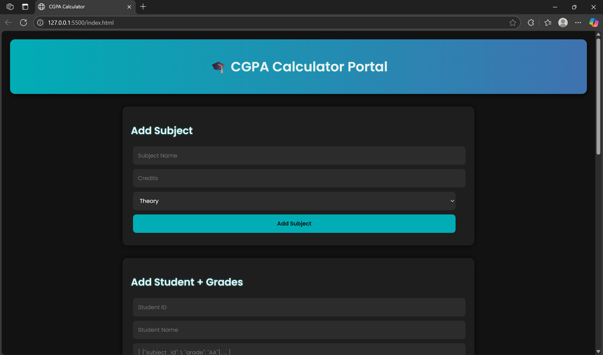
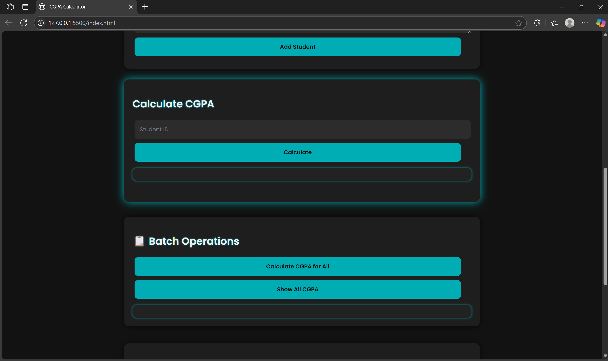
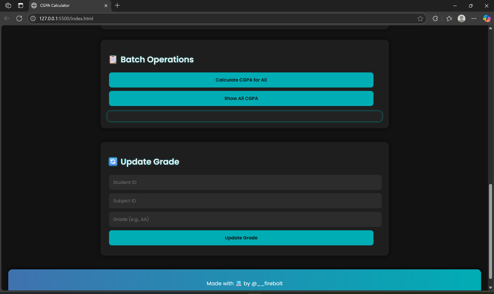

# 🎓 CGPA Calculator

A full-stack CGPA Calculator web app that allows you to manage students, subjects, grades, and calculate CGPAs in real-time using a MySQL backend and Flask API.

---

## 🌙 Features

- 🔧 Add/Edit subjects (theory/practical)
- 👨‍🎓 Add students with grades
- 🔁 Automatically calculate CGPA (individual and batch)
- ✏️ Update grades anytime and recalculate
- 📊 View CGPA records in tabular format
- 🧠 Responsive dark-themed UI with:
  - Toast notifications
  - Spinners for loading
  - Smooth scroll and clean forms

---

## 🖼️ Screenshots

| Main UI | CGPA Results |
|--------|--------------|
|  |  |

> Upload screenshots inside a `screenshots/` folder

---

## ⚙️ Tech Stack

- **Frontend:** HTML, CSS (Dark Theme), JavaScript  
- **Backend:** Flask (Python)  
- **Database:** MySQL  
- **Tools:** Toast, Spinner, Fetch API, Local Scroll  

---

## 🚀 Getting Started

### 🔧 1. Clone the Repo

```bash
git clone https://github.com/YOUR_USERNAME/cgpa-calculator.git
cd cgpa-calculator
```

## 🐍 2. Setup Backend

### Install Python dependencies:

```bash
pip install flask flask-cors mysql-connector-python
python cgpa.py
```

## 🌐 3. Open Frontend

Open `index.html` in your browser.  
Make sure the backend is running at: [http://localhost:5000](http://localhost:5000)

---

## 📁 Folder Structure

```bash
cgpa-calculator/
│
├── cgpa.py              # Flask backend
├── index.html           # Frontend UI
├── style.css            # Styling (Dark Theme)
├── script.js            # JS Logic (Toast, Spinner, Fetch)
├── screenshots/         # UI Screenshots
└── README.md            # Documentation
```
---

## 🧑‍💻 Author

Made with care by **Neha Chaudhary** – ECE student at IIIT KOTA working on Web Development and DSA.

---

## 📄 License

This project is licensed under the **Apache License 2.0**.  
You are free to use, modify, and distribute this code with proper attribution.  
See the full license details in the [LICENSE](LICENSE) file.

---

## 🖼️ Screenshots

### 🏠 Homepage 


### Toggle


### 🎮 Mini Game

